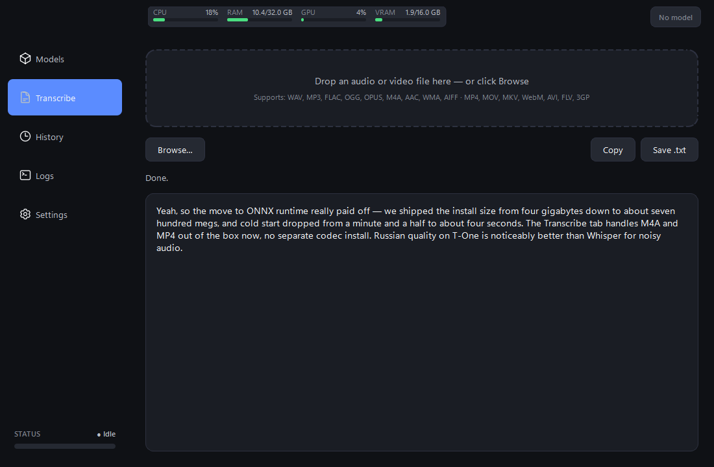

# Lazy to Text

Press a global hotkey, speak, paste. Local speech-to-text for Windows
and macOS, with a Qt UI and a single ONNX inference path.

[](https://www.python.org/)
[](https://doc.qt.io/qtforpython-6/)
[](https://onnxruntime.ai/)
[](https://github.com/istupakov/onnx-asr)
[](LICENSE)


---

## What it is

A desktop application that records microphone audio on a global hotkey,
transcribes it locally through ONNX Runtime, and pastes the result into
the focused window. A second tab transcribes audio / video files
(drop or browse) — WAV, MP3, FLAC, OGG, OPUS, M4A, MP4, MOV, MKV,
WebM and friends.

The audio never leaves the machine. No cloud APIs, no PyTorch in the
install tree — every model runs through ONNX Runtime and downloads
from Hugging Face on first use. Distribution is source-only: clone
the repo, ``uv sync``, ``uv run lazy-to-text-ui``. No PyInstaller
build, no installer.

## Features

- **One inference path, nine models.** Every model — Whisper, GigaAM v3,
  Parakeet TDT v3, NVIDIA Canary, T-One, Vosk RU — loads through the same
  `OnnxAsrBackend` (built on [`onnx-asr`](https://github.com/istupakov/onnx-asr)).
  No NeMo, no PyTorch, no CTranslate2 — install size shrinks from ~4 GB
  to ~700 MB.
- **Hotkey dictation.** `Ctrl+F2` records, `Ctrl+F3` stops + transcribes +
  pastes. `Ctrl+F6` discards. Hotkeys remappable in Settings.
- **File transcription.** A separate Transcribe tab accepts drag-drop or
  Browse. Decoded with `soundfile` for native formats (WAV / FLAC / OGG /
  OPUS / AIFF) and a bundled static `ffmpeg` for everything else (MP3 /
  M4A / AAC / WMA / MP4 / MOV / MKV / WebM / AVI / FLV / 3GP). Any
  audio or video container the user typically has on disk just works.
- **Russian-strong lineup.** GigaAM v3 (CTC + RNN-T, both with built-in
  punctuation), T-One (Russian Conformer trained on 80k hours of speech,
  crushes Whisper on telephony / noisy audio), Vosk RU (30 / 50 MB
  Zipformers for low-spec laptops), plus Parakeet TDT v3 and Canary 1B v2
  for multilingual coverage that includes Russian.
- **Hardware acceleration with auto CPU fallback.** Windows uses
  `onnxruntime-gpu` (CUDA + TensorRT providers); macOS uses
  `onnxruntime` with `CoreMLExecutionProvider` for Apple Silicon
  (Neural Engine + GPU + CPU). Both platforms try the accelerator
  first and silently retry on CPU if the driver / hardware is
  missing or the model contains an unsupported op. Works on a
  laptop without a discrete GPU.
- **Per-model inference settings.** Whisper cards show the full panel
  (language / VAD / beam / temperature / prompt). Parakeet shows just
  the timestamps toggle. GigaAM / T-One / Vosk are end-to-end with no
  per-call knobs.
- **Cancel-load button.** Mis-clicked a 1.6 GB model? A red Cancel pill
  appears next to the loading indicator. One click rolls back the active
  card / config / topbar pill — no waiting for the download to finish.
- **Live resource monitor.** Topbar widget tracks CPU / RAM / GPU
  utilisation / VRAM via `psutil` + `nvidia-ml-py` (Windows only),
  refreshing every two seconds. Hides the GPU bar gracefully on
  machines without NVIDIA — including all Macs.
- **Recording status chip with live VU.** A `STATUS · Idle / Recording /
  Processing` chip in the sidebar's bottom-left corner mirrors the
  topbar's resource cards. The VU meter under it animates while
  recording, so silent / muted mics show up before you finish speaking.
- **Toast confirmation.** A bottom-right banner with a preview of the
  latest transcription pops up after every successful run.
- **Storage card.** Shows the resolved models folder (overridable),
  total disk used by the cache (computed asynchronously), and an
  Open-folder shortcut to inspect / clean the cache in Explorer
  (Windows) or Finder (macOS).
- **Searchable model browser.** Search box + family chips (All / Whisper
  Turbo / GigaAM / Parakeet / T-One / Vosk / Canary) narrow the grid.
  Empty-state placeholder when nothing matches.
- **Coloured logs view.** Records colour-coded by level + logger source,
  with a "Show network logs" toggle that hides httpx / huggingface_hub
  noise and a search field that filters the buffer on the fly.
- **History detail dialog.** Double-click any row to read the full
  transcription, copy with one button. Hover for full-text tooltip.
  Export to plain text via the toolbar.
- **Auto-paste into the focused window.** Triggered by simulated
  keystrokes; the live `ClipboardManager` picks up toggle changes in
  Settings without a restart.
- **Modern visual treatment.** Soft drop-shadow cards, Heroicons in
  the sidebar, bundled Inter font, family-coloured badges, smooth
  cosine-eased pixel-level scrolling everywhere — refresh-rate-aware
  (60 / 144 / 240 Hz), so animations match the user's monitor.
- **System tray with state-aware icon**, single-instance guard
  (named mutex on Windows, `filelock` lockfile on macOS),
  confirmation dialog before destructive history wipes, `Ctrl+1..5`
  keyboard shortcuts to switch tabs.

## Quick start

Requires Python 3.12, [uv](https://docs.astral.sh/uv/), and a
microphone.

- **Windows 10 / 11**: a CUDA-capable NVIDIA GPU is recommended for the
  larger models (Whisper Large, Parakeet, Canary).
- **macOS 12+ on Apple Silicon (M-series)**: CoreML routes inference
  through the Neural Engine + GPU automatically. Intel Macs run on CPU.
- Vosk RU, Whisper Base, GigaAM CTC and T-One run comfortably on
  CPU on either platform.

```bash
git clone https://github.com/aa-blinov/lazy-to-text.git
cd lazy-to-text

uv sync                      # creates the venv from uv.lock
uv run lazy-to-text-ui       # launch the app
```

The first launch leaves no model loaded — pick one from the Models tab
and click **Download**. Weights land in `<project>/models/hub/`
(HF cache); the path is overridable via Settings → Storage. Press
`Ctrl+F2`, speak, `Ctrl+F3` — the transcript pastes into whatever
window has focus, and a banner confirms in the bottom-right.

To transcribe an audio or video file instead, switch to the
**Transcribe** tab, drop a file (or click Browse), and watch the
result appear.

### macOS first-run permissions

Two system prompts appear the first time you exercise the relevant
features:

- **Microphone** — requested by `sounddevice` / CoreAudio when the
  recorder opens the input device. Click *Allow*.
- **Accessibility** — required by `pynput` for global hotkeys and by
  `pyautogui` for the auto-paste keystroke. macOS won't prompt for
  this automatically; open *System Settings → Privacy & Security →
  Accessibility* and add the binary you launch.

  Recommended path: build the proper `.app` bundle (next section)
  and add **`Lazy to Text.app`** instead of trying to whitelist
  `python3.12` from inside the venv — `.app` gives you a clean
  identity in the Accessibility list, persistent permissions
  across sessions, and a real Cmd-Tab title.

### Build a portable bundle

Both platforms have a packaging path that turns the source tree
into a drop-onto-another-machine artifact. The wrapper scripts
under `scripts/` handle every prerequisite step (icon refresh,
`uv sync`, codesign / runtime hook, …); pick the one matching
your OS.

#### macOS — `.app` via py2app

```bash
./scripts/build-macos.sh             # alias / dev (5–10 s)
open "dist/Lazy to Text.app"
```

The script invokes [`py2app`](https://py2app.readthedocs.io) in
**alias mode**: the `.app` is a thin shell that symlinks back into
the project's venv, so each build takes seconds and source edits
in `app/` are picked up on the next launch with no rebuild. The
host process now reports as **Lazy to Text** (not `python3.12`),
microphone / Accessibility prompts use the bundle identifier
`ai.eora.lazytotext`, and the bundled icon is the same squircle
the in-app code paints.

The bundle ships the standard macOS App menu (under the Apple
logo): *About Lazy to Text*, *Settings…* (`Cmd+,`), and *Quit
Lazy to Text* (`Cmd+Q`). Window-close hides to the menu-bar tray;
`Cmd+Q` is the explicit full-quit path.

When you're ready to distribute:

```bash
./scripts/build-macos.sh --release   # full bundle, 5–10 minutes
```

…produces a self-contained `.app` (no venv dependency) under
`dist/`. Code signing is ad-hoc only; pair with an Apple Developer
ID + `xcrun notarytool submit` if you want to ship outside the
Mac App Store without Gatekeeper warnings.

##### Reproducible macOS build notes

The macOS packaging path is intentionally scripted so the same repo
state produces the same `.app` structure on another Mac with the same
Python / dependency lockfile. The moving parts are:

1. `scripts/build-macos.sh`
   - wipes `build/` and `dist/`
   - regenerates `app/assets/lazy_to_text.icns`
   - temporarily strips the `dependencies = [...]` block from
     `pyproject.toml`
   - runs `.venv/bin/python setup.py py2app` (or `py2app -A`)
   - ad-hoc signs the finished bundle with `codesign --deep --force`
2. `setup.py`
   - pins the bundle identifier to `ai.eora.lazytotext`
   - seeds `TCL_LIBRARY` / `TK_LIBRARY` from the live interpreter so
     `py2app`'s unconditional `tkinter` probe does not abort on the
     uv-managed Python runtime
   - patches built-in `zlib` for `py2app 0.28`, which otherwise
     assumes `zlib.__file__` exists in release mode
   - excludes `rubicon` and `tkinter`-related modules that are not
     needed by the app but can break the standalone build
   - force-includes runtime-critical packages such as `PySide6`,
     `onnxruntime`, `onnx_asr`, `pynput`, `sounddevice`,
     `_sounddevice_data`, `pyautogui`, and `platformdirs`

If you need to reproduce the release bundle from scratch on another
Mac, the shortest safe path is:

```bash
uv sync
./scripts/build-macos.sh --release
open "dist/Lazy to Text.app"
```

To install the built app the same way we do during local testing:

```bash
ditto "dist/Lazy to Text.app" "/Applications/Lazy to Text.app"
open -n "/Applications/Lazy to Text.app"
```

Useful verification commands:

```bash
codesign -dv "/Applications/Lazy to Text.app" 2>&1 | rg 'Identifier|Signature|TeamIdentifier'
shasum -a 256 "dist/Lazy to Text.app/Contents/MacOS/Lazy to Text" \
               "/Applications/Lazy to Text.app/Contents/MacOS/Lazy to Text"
```

If the app shows a generic `py2app` launch dialog, run the bundle's
real executable directly to see the Python traceback:

```bash
"/Applications/Lazy to Text.app/Contents/MacOS/Lazy to Text"
```

The runtime log for the frozen app lives at:

```text
~/Library/Logs/LazyToText/app.log
```

Important limitation: the build is signed ad-hoc, not with a stable
Developer ID certificate. macOS therefore treats each rebuilt app as a
new code identity for privacy permissions. After reinstalling a fresh
bundle into `/Applications`, you may need to re-grant
`Accessibility` for `Lazy to Text.app` before global hotkeys and
synthetic paste keystrokes work again.

#### Windows — portable folder via PyInstaller

```powershell
.\scripts\build-windows.ps1                # default folder build
.\scripts\build-windows.ps1 -Clean         # nuke build/ + dist/ first
.\scripts\build-windows.ps1 -OneFile       # single-file .exe (slower start)
```

The default mode is a **folder bundle** under `dist\LazyToText\` —
copy the whole folder onto another Windows box, double-click
`LazyToText.exe`, and it runs. No installer, no admin rights, no
PATH munging. `-OneFile` packs everything into a single
self-extracting `.exe` for cases where the folder structure is
inconvenient (slower startup, occasional false-positives from
heuristic AVs).

The build pulls hidden imports from `pywin32` (Win32 API),
`global_hotkeys` (system-wide hotkey listener), `PySide6.Qt*`,
and the full `onnx_asr` / `onnxruntime` submodule trees — anything
loaded via late-bound `importlib` that PyInstaller's static
analyser can't see. The runtime hook at
`scripts/pyi_runtime_hook.py` patches `sys.stdout` / `sys.stderr`
back to a discarding writer (windowed builds null them out, which
crashes any tqdm-using library), and adds `CREATE_NO_WINDOW` to
`subprocess.Popen` calls so child processes don't flash a
`cmd.exe` window.

#### Where the bundle stores user data

Both bundles set `sys.frozen` and switch over to per-user directories
via [`platformdirs`](https://github.com/tox-dev/platformdirs) — the
.app would otherwise have to write inside `/Applications` (read-only
without admin) and the Windows folder bundle would write inside
`Program Files` (same problem, plus AV / UAC pushback):

| Data | macOS `.app` | Windows portable |
| --- | --- | --- |
| `config.yaml` | `~/Library/Application Support/LazyToText/` | `%APPDATA%\LazyToText\` |
| `app.log` + history | `~/Library/Logs/LazyToText/` | `%LOCALAPPDATA%\LazyToText\Log\` |
| Model weights | `~/Library/Caches/LazyToText/models/` | `%LOCALAPPDATA%\LazyToText\Cache\models\` |

`uv run lazy-to-text-ui` (dev mode) keeps the legacy in-tree paths
(`<project>/config.yaml`, `<project>/logs`, `<project>/models`) so
iterating on source doesn't pollute the user dirs. The Storage card
in Settings can still override `models/` to any path — `HF_HOME` is
updated live, so the next download lands in the new dir without a
restart.

## Screenshots

| Models | Transcribe |
| :---: | :---: |
|  |  |

| History | Logs |
| :---: | :---: |
|  |  |

| Settings |   |
| :---: | :---: |
|  |   |

## Hotkeys

| Action | Default — Windows / Linux | Default — macOS | Configurable |
| --- | --- | --- | --- |
| Start recording | `Ctrl+F2` | `Ctrl+F8` | yes — Settings tab |
| Stop recording + transcribe | `Ctrl+F3` | `Ctrl+F9` | yes — Settings tab |
| Cancel current recording | `Ctrl+F6` | `Ctrl+F10` | yes — Settings tab |
| Switch tab (Models / Transcribe / History / Logs / Settings) | `Ctrl+1..5` | `Ctrl+1..5` | no |
| Open Settings | — | `Cmd+,` | no — App menu |
| Quit application | tray menu | `Cmd+Q` | no — App menu |
| Hide / show window | close button / tray click | close button / menu-bar click | no |

macOS reserves `Ctrl+F1`..`Ctrl+F7` for system-wide keyboard
navigation (focus → menu bar / Dock / window / toolbar / floating
window / next window / status menu). `pynput` never sees the
events because the OS captures them first, so we ship higher
F-keys as the per-platform defaults. Both sets are still freely
re-bindable.

Hotkey edits in the Settings tab persist immediately on focus loss; no Save
button. The auto-paste toggle behaves the same way and is also pushed live
into the running `ClipboardManager`.

## Models

Every model is an ONNX export downloaded from Hugging Face on first use.

| Alias | HF repo | Size | Languages | Best for |
| --- | --- | --- | --- | --- |
| `whisper-large-v3-turbo` | `onnx-community/whisper-large-v3-turbo` | 1.6 GB | multilingual | universal pick |
| `whisper-large-v3` | `onnx-community/whisper-large-v3` | 3.1 GB | multilingual | best raw quality |
| `gigaam-v3-ctc` | `istupakov/gigaam-v3-onnx` | 260 MB | RU only | fast Russian dictation |
| `gigaam-v3-rnnt` | `istupakov/gigaam-v3-onnx` | 290 MB | RU only | best Russian quality |
| `t-one` | `t-tech/T-one` | 290 MB | RU only | noisy / telephony Russian |
| `vosk-ru-small` | `alphacep/vosk-model-small-ru` | 30 MB | RU only | low-spec laptop CPU |
| `vosk-ru` | `alphacep/vosk-model-ru` | 50 MB | RU only | balanced CPU choice |
| `parakeet-tdt-v3` | `istupakov/parakeet-tdt-0.6b-v3-onnx` | 1.2 GB | 25 langs incl. Russian | fastest multilingual |
| `canary-1b-v2` | `istupakov/canary-1b-v2-onnx` | 2.0 GB | 25 langs incl. Russian | short-utterance accuracy |

## Configuration

`config.yaml` lives in the project root in dev mode (resolved by
walking up from the working directory to the nearest
`pyproject.toml`); when running from the `.app` bundle on macOS it
moves to `~/Library/Application Support/LazyToText/config.yaml`
(see *Where the bundle stores user data* above). Most fields are
exposed in the UI; the file is the source of truth.

```yaml
whisper:
  model: parakeet-tdt-v3        # any alias from app/model_mapping.py, or
                                # any HF repo path with an ONNX export
  device: auto                  # auto | cpu | cuda | coreml
                                # auto = CUDA on Windows w/ NVIDIA,
                                # CoreML on Apple Silicon, CPU otherwise
  compute_type: float32         # float16 | int8 | float32
  language: auto                # ISO code, or "auto" for auto-detect
                                # (only Whisper honours this)
  beam_size: 5                  # legacy field, ignored by ONNX path

# Per-model overrides — written by the inline Inference settings panel
# on the active card.  Each entry is keyed by alias.
model_overrides:
  whisper-large-v3-turbo:
    language: ru
    vad_filter: true
    beam_size: 7
    temperature: 0.0
    initial_prompt: "Anthropic, Claude, onnxruntime, GigaAM."
  parakeet-tdt-v3:
    timestamps: false
  gigaam-v3-rnnt: {}            # GigaAM ignores all of these (end-to-end)

hotkey:
  # Defaults differ per platform — see the Hotkeys section above
  # for why macOS uses higher F-keys.
  #   Windows / Linux: ctrl+f2 / ctrl+f3 / ctrl+f6
  #   macOS:           ctrl+f8 / ctrl+f9 / ctrl+f10
  start_recording_hotkey: ctrl+f2
  stop_recording_hotkey: ctrl+f3
  cancel_recording_hotkey: ctrl+f6

clipboard:
  auto_paste: true
  preserve_clipboard: false
  key_simulation_delay: 0.05

audio:
  channels: 1
  dtype: float32
  max_duration: 300
  device: 31                    # input device index from sounddevice;
                                # the Settings tab dropdown writes this

audio_feedback:
  enabled: true
  start_sound: assets/sounds/record_start.wav
  stop_sound: assets/sounds/record_stop.wav
  cancel_sound: assets/sounds/record_cancel.wav

storage:
  models_dir: ""                # empty = use default
                                #   dev:  <project>/models
                                #   .app: ~/Library/Caches/LazyToText/models
                                # — both created on first model download.

history:
  enabled: true
  max_entries: 1000
  auto_cleanup_days: 30
```

To reset settings, delete `config.yaml` and relaunch — defaults are written
back. Settings → Storage carries Reset / Move / Open-folder controls if
you only want to reset the storage path.

## Architecture

### Layer overview

```
                                 ┌─────────────────────────────┐
                                 │  Qt UI (app/gui)            │
                                 │  views, widgets, controllers│
                                 └─────────────┬───────────────┘
                                               │
                                 Qt signals    │
                                               ▼
┌─────────────┐    callbacks    ┌──────────────────────────────┐
│ Hotkey      ├────────────────▶│  StateManager  (app/)        │
│ Listener    │                 │  recording / processing /    │
└─────────────┘                 │  model_loading state machine │
                                 └─────┬───────────────┬─────────┘
                                       │               │
                            audio_data │               │ transcribe(audio)
                                       ▼               ▼
                          ┌──────────────────┐  ┌──────────────────────┐
                          │ AudioRecorder    │  │ TranscriptionBackend │
                          │ sounddevice +    │  │   (Protocol)         │
                          │ daemon thread    │  └─────────┬────────────┘
                          └──────────────────┘            │
                                                          ▼
                                          ┌────────────────────────────┐
                                          │ RegistryBackend  (façade)  │
                                          │ alias → canonical / family │
                                          │ / onnx_load_id; rebuilds   │
                                          │ inner on family change.    │
                                          └────────────┬───────────────┘
                                                       │
                                                       ▼
                                          ┌────────────────────────────┐
                                          │ OnnxAsrBackend             │
                                          │ family-aware (whisper /    │
                                          │ gigaam / parakeet);        │
                                          │ CUDA / CoreML → CPU        │
                                          │ fallback; 25 s chunking    │
                                          │ for long audio.            │
                                          └────────────┬───────────────┘
                                                       │
                                                       ▼
                                          ┌────────────────────────────┐
                                          │ onnx-asr + onnxruntime     │
                                          │ (CUDA on Windows, CoreML   │
                                          │  on Apple Silicon, CPU     │
                                          │  everywhere)               │
                                          └────────────────────────────┘
```

### Module layout

```
app/
├── gui/                                   ← Qt UI (everything user-facing)
│   ├── app.py                                application entry point + main()
│   ├── main_window.py                       sidebar + stacked views shell
│   ├── recording_factory.py                 builds the StateManager + backend stack
│   ├── refresh_rate.py                      display-aware tick interval helper
│   ├── smooth_scroll.py                     cosine-eased wheel animation
│   ├── theme.py / log_bridge.py             design tokens + logging→Qt bridge
│   ├── controllers/
│   │   ├── app_controller.py                  AppController orchestrator (815 LOC)
│   │   │                                      ├ Models tab wiring
│   │   │                                      ├ Shortcuts/Settings + mic test
│   │   │                                      └ Recording state + cancel-load
│   │   ├── _history_mixin.py                  HistoryMixin (clear / export / toast)
│   │   ├── _storage_mixin.py                  StorageMixin (path / size / Open folder)
│   │   ├── _transcribe_mixin.py               TranscribeMixin (file dispatch)
│   │   ├── _tray_mixin.py                     TrayMixin (show / quit)
│   │   └── recording_controller.py            QObject wrapper over StateManager
│   ├── views/                              one widget per sidebar tab
│   │   ├── models_view.py / history_view.py / logs_view.py
│   │   ├── shortcuts_view.py / transcribe_view.py / placeholder.py
│   ├── widgets/                            building blocks
│   │   ├── model_card.py / sidebar.py / topbar.py / toast.py
│   │   ├── inference_settings_panel.py        Whisper-style 5-knob panel
│   │   ├── parakeet_inference_settings_panel.py  Parakeet timestamps toggle
│   │   ├── recording_status_widget.py / vu_meter.py / resource_widget.py
│   │   ├── tray_icon.py / flow_layout.py
│   │   └── styles/                            dark.qss + Heroicon SVGs
│   └── styles/dark.qss                     stylesheet (color tokens templated in)
├── backends/                              ← ASR inference (single engine)
│   ├── base.py                              TranscriptionBackend Protocol
│   ├── onnx_backend.py                      OnnxAsrBackend (the actual inference)
│   ├── registry_backend.py                  RegistryBackend (alias resolution façade)
│   └── _progress.py                         tqdm hook for HF download progress
├── state_manager.py                       ← domain: recording / processing FSM
├── audio_recorder.py                      ← domain: sounddevice capture
├── audio_feedback.py                      ← domain: start/stop sounds
├── clipboard_manager.py                   ← domain: paste delivery
├── config_manager.py                      ← domain: yaml read/write
├── history_manager.py                     ← domain: transcription history JSON
├── hotkey_listener.py                     ← domain: cross-platform hotkey binding
│                                            (global-hotkeys on Win, pynput elsewhere)
├── instance_manager.py                    ← domain: single-instance lock
│                                            (named mutex on Win, filelock elsewhere)
├── model_mapping.py                       ← domain: registry of supported models
├── inference_settings.py                  ← domain: per-model settings dataclasses
├── resource_monitor.py                    ← domain: CPU/RAM/GPU sampler
└── utils.py                               ← domain: cache/path helpers
```

### Layering rules

- **`app/gui/`** is the only layer allowed to import Qt.  Everything
  else (`backends/`, the domain modules at `app/`'s root) is plain
  Python with no UI dependencies — they're easy to test in isolation
  and swap engines without touching the UI.
- **`app/backends/`** depends on `app.utils` and `app.inference_settings`
  but knows nothing about Qt.  Cross-engine swaps go through
  `RegistryBackend` which resolves the alias from `model_mapping`.
- **Domain modules** at `app/`'s root depend on each other via
  Protocols (`TranscriptionBackend`, etc.) — no circular imports, the
  dependency graph fans inward toward `utils`.
- **`AppController`** is mixin-composed: each side-feature (Storage,
  Transcribe, Tray, History) lives in its own `_*_mixin.py` so the
  orchestrator file stays focused on the model-load + recording loop.

For file transcription, `OnnxAsrBackend.transcribe_file(path)` decodes
the file via `soundfile` first; on failure it falls back to a bundled
static `ffmpeg` from `imageio-ffmpeg` (raw PCM through stdout pipe — no
temp files, the user's source file is never modified or copied).

There's no splash screen — ONNX loads in 3–5 s with no GIL-blocking
cold import, so the main window appears immediately and the model
becomes ready in the background.

## Hardware acceleration

`device: auto` (the default in `config.yaml`) is platform-aware:

- **Windows**: ONNX Runtime picks `CUDAExecutionProvider` when
  `onnxruntime-gpu` is installed (it is, via the `[gpu]` extra) and
  a working NVIDIA driver is present, falling back to CPU otherwise.
  Explicit overrides: `device: cuda` or `device: cpu`.
- **macOS**: the backend stages
  `CoreMLExecutionProvider` ahead of CPU with
  `ModelFormat=MLProgram` and `MLComputeUnits=ALL`, so CoreML's
  dispatcher routes ops to Neural Engine / GPU / CPU per-op.
  Explicit overrides: `device: coreml` or `device: cpu`.

Both platforms retry on CPU automatically if the accelerator session
fails at session-create time (driver missing, op unsupported by the
EP, etc.). The Logs view surfaces the retry as a warning.

CPU-only is fine for `vosk-ru-small`, `vosk-ru`, `t-one`, and
`gigaam-v3-ctc`. The larger Whisper / Parakeet / Canary models
(`whisper-large-v3*`, `parakeet-tdt-v3`, `canary-1b-v2`) are usable
on CPU but noticeably slower; CUDA on Windows or CoreML on Apple
Silicon brings them down to a few seconds for a 1-minute clip.

## Development

```bash
uv sync                                        # production deps + dev tools
uv run pytest                                  # full test suite (590+ tests)
uv run lazy-to-text-ui                         # launch from source
uv run python scripts/generate_screenshots.py  # regenerate docs/screenshots
```

Tests live in `tests/` and use `pytest-qt`. Cross-thread paths (resource
monitor, mic test, model load, file transcription) are covered with
fakes that don't touch the actual hardware or libraries — the suite runs
in ~30 s without ever hitting the network or instantiating an ONNX
session.

## Roadmap

- [ ] Onboarding overlay for first-launch users (which model to pick, how the hotkey works)
- [ ] Per-model VRAM forecasting that warns before downloading something the GPU can't fit
- [ ] Light theme + theme switcher
- [ ] Word-level timestamps for the file-transcribe view (the underlying `onnx-asr` already supports them)
- [ ] Speaker diarisation (file transcribe → labelled segments)

## Tech stack

- Python 3.12
- PySide6 (Qt 6.11) for the UI, bundled Inter Variable + Heroicons
- [onnx-asr](https://github.com/istupakov/onnx-asr) +
  [ONNX Runtime](https://onnxruntime.ai/) for the single inference
  path — covers Whisper, GigaAM, Parakeet, Canary, T-One, Vosk under
  one API. Windows ships `onnxruntime-gpu` (CUDA + TensorRT), macOS
  ships plain `onnxruntime` (CoreMLExecutionProvider for Apple
  Silicon)
- [`soundfile`](https://github.com/bastibe/python-soundfile) (libsndfile)
  for native audio decoding (WAV / FLAC / OGG / OPUS / AIFF)
- [`imageio-ffmpeg`](https://github.com/imageio/imageio-ffmpeg) —
  bundled static ffmpeg binary for the MP3 / M4A / MP4 / MKV / WebM
  file path
- `sounddevice` for audio capture, `pyperclip` for clipboard text
- Hotkeys + auto-paste:
  Windows uses `global-hotkeys` + `pywin32` (native `RegisterHotKey`
  + `keybd_event`); macOS / Linux use [`pynput`](https://pynput.readthedocs.io/)
  (`GlobalHotKeys` + key simulation through `pyautogui` Cmd/Ctrl+V)
- Sound feedback: `winsound` (Windows) / [`playsound3`](https://github.com/szmikler/playsound3)
  (macOS via AppKit, Linux via GStreamer)
- Single-instance lock: native named mutex on Windows, `filelock`
  lockfile elsewhere
- Cross-platform user dirs via [`platformdirs`](https://platformdirs.readthedocs.io/)
- `psutil` for CPU / RAM, `nvidia-ml-py` (Windows-only) for the GPU
  topbar widget

## Acknowledgements

- [onnx-asr](https://github.com/istupakov/onnx-asr) — the universal ONNX
  loader that made the single-engine refactor possible.
- [OpenAI Whisper](https://github.com/openai/whisper) — the underlying
  multilingual model; ONNX exports by [onnx-community](https://huggingface.co/onnx-community).
- [GigaAM](https://github.com/salute-developers/GigaAM) (Sber) — the
  Russian-specialised acoustic model.
- [T-One](https://huggingface.co/t-tech/T-one) (T-Tech) — Russian
  Conformer-CTC trained on 80k hours of speech.
- [Vosk](https://alphacephei.com/vosk/) (alphacephei) — the lightweight
  Zipformer Russian models.
- [Parakeet TDT v3](https://huggingface.co/nvidia/parakeet-tdt-0.6b-v3)
  and [Canary v2](https://huggingface.co/nvidia/canary-1b-v2) (NVIDIA) —
  the multilingual European-language engines.
- [imageio-ffmpeg](https://github.com/imageio/imageio-ffmpeg) — bundled
  static ffmpeg.
- [Heroicons](https://heroicons.com) (Tailwind Labs) — sidebar icons.
- [Inter](https://rsms.me/inter/) (Rasmus Andersson) — bundled UI font.
- UI direction borrowed from [Spokenly](https://spokenly.app/) (macOS).

## License

[MIT](LICENSE)
