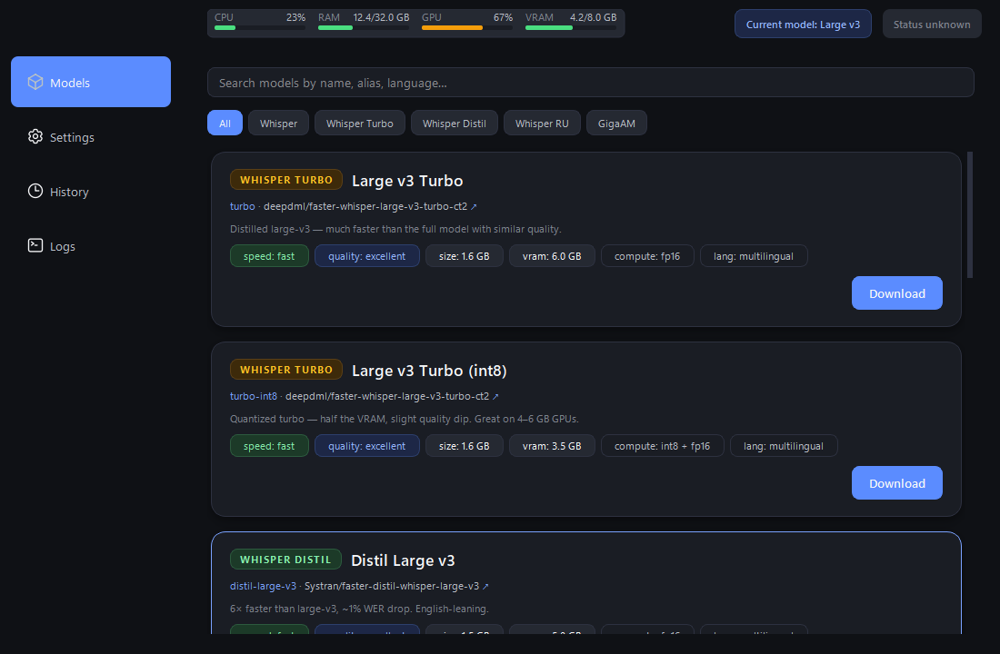
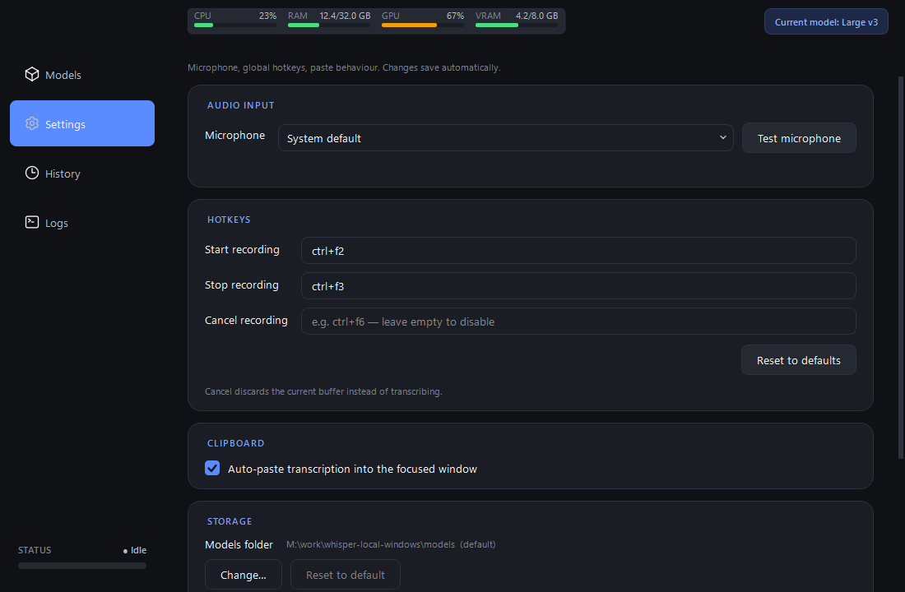
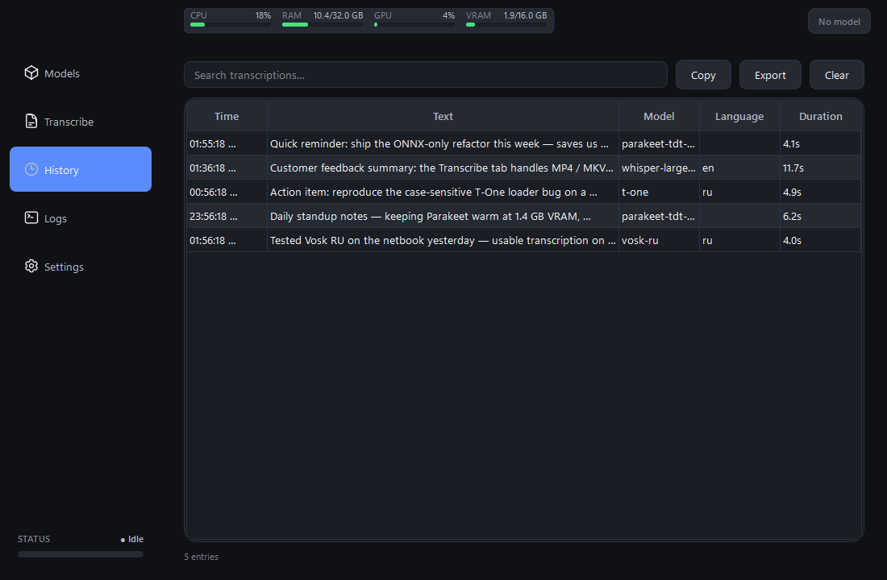
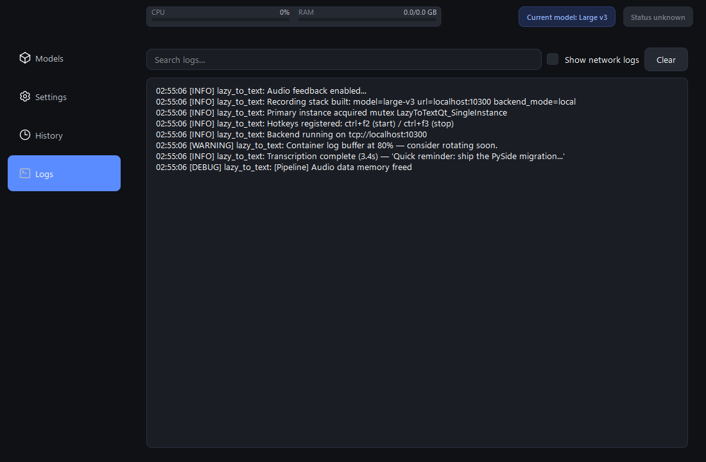

# Lazy to Text

Press a global hotkey, speak, paste. Local Whisper-based speech-to-text for Windows, with a Qt UI.

[](https://www.python.org/)
[](https://doc.qt.io/qtforpython-6/)
[](https://www.docker.com/)
[](LICENSE)


---

## What it is

A Windows desktop application that records microphone audio on a global hotkey,
transcribes it through a local [faster-whisper](https://github.com/SYSTRAN/faster-whisper)
container, and pastes the resulting text into the focused window.

The audio never leaves the machine: transcription happens entirely against a
locally-running Wyoming-protocol service (`linuxserver/faster-whisper:gpu`).
Cloud APIs are not involved.

## Features

- Global hotkey activation (`Ctrl+F2` / `Ctrl+F3` by default).
- Auto-paste into the foreground window after transcription.
- 6 model presets (`tiny` → `large-v3`) with size / VRAM / speed / quality
  metadata; switch from the UI, the running container reloads automatically.
- Searchable transcription history persisted to JSON.
- Settings auto-save on edit; "Reset to defaults" button.
- Live application log stream inside the UI.
- Native Windows system tray (close button hides to tray; right-click → Show / Quit).
- Single-instance guard via a named mutex with a branded warning dialog.
- Audio feedback for start / stop / cancel events with prewarmed playback so
  the first keypress is never silent.

## Quick start

Requires Windows 10/11, Python 3.12, Docker Desktop, and a microphone.

```powershell
git clone https://github.com/aa-blinov/lazy-to-text.git
cd lazy-to-text

# uv handles the venv and the lock-file pinned dependencies
uv sync

# bring up the local Wyoming faster-whisper backend
docker compose up -d

# launch the app
uv run lazy-to-text-ui
```

Press `Ctrl+F2`, speak, press `Ctrl+F3` — the transcript is pasted into
whatever has focus when you stop recording.

## Screenshots

| Models | Shortcuts |
| :---: | :---: |
|  |  |

| History | Logs |
| :---: | :---: |
|  |  |

## Hotkeys

| Action | Default | Configurable |
| --- | --- | --- |
| Start recording | `Ctrl+F2` | yes — Shortcuts tab |
| Stop recording + transcribe | `Ctrl+F3` | yes — Shortcuts tab |
| Hide / show window | close button / tray click | no |

Hotkey edits in the Shortcuts tab persist immediately on focus loss; no Save
button. The auto-paste toggle behaves the same way.

## Configuration

`config.yaml` is created on first launch in the project root (or next to the
executable in a built distribution). Most fields are exposed in the UI; the
file is the source of truth.

```yaml
whisper:
  backend_mode: local            # local | external
  model: large-v3                # alias from app/model_mapping.py
  beam_size: 5
  language: ru                   # or "auto"
  local_url: http://localhost:10300
  external_url: http://remote-host:10300

hotkey:
  start_recording_hotkey: ctrl+f2
  stop_recording_hotkey: ctrl+f3

clipboard:
  auto_paste: true
  preserve_clipboard: false
  key_simulation_delay: 0.05

audio:
  channels: 1
  dtype: float32
  max_duration: 300

audio_feedback:
  enabled: true
  start_sound: assets/sounds/record_start.wav
  stop_sound: assets/sounds/record_stop.wav
  cancel_sound: assets/sounds/record_cancel.wav

history:
  enabled: true
  max_entries: 1000
  auto_cleanup_days: 30
```

To reset settings, delete `config.yaml` and relaunch — defaults are written
back. The Shortcuts tab "Reset to defaults" button does the same for hotkey
and auto-paste fields without touching the rest of the file.

## Architecture

```
                                        ┌─────────────────────────────┐
                                        │  Qt UI (app/gui)            │
                                        │  views, widgets, controllers│
                                        └─────────────┬───────────────┘
                                                      │
                                       Qt signals     │
                                                      ▼
┌─────────────┐    callbacks    ┌──────────────────────────────────┐
│ Hotkey      ├────────────────▶│  StateManager  (app/)            │
│ Listener    │                 │  recording / processing / model  │
└─────────────┘                 │  loading state machine            │
                                 └─────┬───────────────┬─────────────┘
                                       │               │
                            audio_data │               │ transcribe(audio)
                                       ▼               ▼
                          ┌──────────────────┐ ┌──────────────────────┐
                          │ AudioRecorder    │ │ WhisperEngine        │
                          │ sounddevice +    │ │ Wyoming TCP client   │
                          │ daemon thread    │ │ (asyncio.run wrap)   │
                          └──────────────────┘ └────────┬─────────────┘
                                                        │
                                                        ▼
                                             ┌─────────────────────┐
                                             │ Docker container    │
                                             │ linuxserver/        │
                                             │ faster-whisper:gpu  │
                                             └─────────────────────┘
```

The Qt layer (`app/gui/`) holds every UI concern. The domain layer
(`app/state_manager.py`, `app/audio_recorder.py`, `app/whisper_engine.py`,
`app/clipboard_manager.py`) is what `RecordingController` wires Qt signals
into. Backend lifecycle (start / stop, status polling) is delegated to
`app/docker_backend_manager.py`, polled off the UI thread by
`BackendStatusPoller`.

## Building a standalone executable

```powershell
.\build-exe.ps1            # folder build via lazy_to_text.spec
.\build-exe.ps1 -OneFile   # single-file build (assets unpacked from _MEIPASS)
.\build-exe.ps1 -Clean     # remove dist/ and build/ first
```

Output: `dist\LazyToText\LazyToText.exe` (folder mode, ~144 MB, 264 files,
fastest startup) or `dist\LazyToText.exe` (`-OneFile`, ~120 MB, slower
startup because assets unpack on each run). The build script delegates to
`pyinstaller` via `uv run`; a fresh `uv sync` runs first unless
`-SkipSync` is passed.

## Installing locally

After a folder build, install per-user (no admin required) into
`%LOCALAPPDATA%\Programs\LazyToText` and add a Start Menu shortcut. Run
from PowerShell, in the repository root:

```powershell
$dest = "$env:LOCALAPPDATA\Programs\LazyToText"
New-Item -ItemType Directory -Force -Path $dest | Out-Null
robocopy "dist\LazyToText" $dest /MIR /NFL /NDL /NJH /NJS /NP

$start = "$env:APPDATA\Microsoft\Windows\Start Menu\Programs\Lazy to Text.lnk"
$wsh   = New-Object -ComObject WScript.Shell
$lnk   = $wsh.CreateShortcut($start)
$lnk.TargetPath       = "$dest\LazyToText.exe"
$lnk.WorkingDirectory = $dest
$lnk.IconLocation     = "$dest\LazyToText.exe"
$lnk.Description      = "Local Whisper speech-to-text for Windows"
$lnk.Save()
```

After this, `Win` + typing "Lazy to Text" launches it from the Start
menu. You can then right-click the taskbar icon → **Pin to taskbar** for
single-click access.

To launch automatically at login, copy the shortcut into the user's
Startup folder:

```powershell
Copy-Item $start "$env:APPDATA\Microsoft\Windows\Start Menu\Programs\Startup\Lazy to Text.lnk"
```

To uninstall:

```powershell
Get-Process LazyToText -ErrorAction SilentlyContinue | Stop-Process -Force
Remove-Item -Recurse -Force "$env:LOCALAPPDATA\Programs\LazyToText"
Remove-Item -Force "$env:APPDATA\Microsoft\Windows\Start Menu\Programs\Lazy to Text.lnk" -ErrorAction SilentlyContinue
Remove-Item -Force "$env:APPDATA\Microsoft\Windows\Start Menu\Programs\Startup\Lazy to Text.lnk" -ErrorAction SilentlyContinue
```

The `config.yaml` and `logs\` folder live next to the executable; they
are deleted along with the install folder. Your transcription history
(`logs\transcription_history.json`) goes with them — back it up first if
you want to keep it.

## Running the Docker backend

The app talks to a local `linuxserver/faster-whisper:gpu` container over
TCP at `localhost:10300`. Start it once from the repository root:

```powershell
docker compose up -d
```

The container restarts automatically with Docker Desktop on subsequent
boots if "Start Docker Desktop on login" is enabled in Docker Desktop
settings. The first run downloads the configured model (~3 GB for
`large-v3`).

## Development

```powershell
uv sync --group dev
uv run pytest                         # full test suite (~210 tests)
uv run python lazy-to-text-ui.py      # run from source
uv run python scripts/generate_screenshots.py  # regenerate docs/screenshots
```

Tests live in `tests/` and use `pytest-qt` with the real Windows Qt platform.
GUI tests can run headless via `QT_QPA_PLATFORM=offscreen`.

## Roadmap

- [ ] Live audio level meter while recording
- [ ] System tray notification when transcription completes
- [ ] Light theme + custom QSS
- [ ] Optional cloud backends (OpenAI, Groq) behind the same UI
- [ ] Distil / turbo model presets in the registry
- [ ] Auto-detect language toggle in the Models tab

## Tech stack

- Python 3.12
- PySide6 (Qt 6.11) for the UI
- Wyoming protocol for backend RPC
- faster-whisper running inside `linuxserver/faster-whisper:gpu`
- `sounddevice` for audio capture, `pyautogui` + `pyperclip` for paste,
  `global-hotkeys` + `pywin32` for Windows-native hotkey registration

## Acknowledgements

- [faster-whisper](https://github.com/SYSTRAN/faster-whisper) and the
  [Wyoming protocol](https://github.com/rhasspy/wyoming).
- The `linuxserver/faster-whisper` container image.
- UI direction borrowed from [Spokenly](https://spokenly.app/) (macOS).

## License

[MIT](LICENSE)
